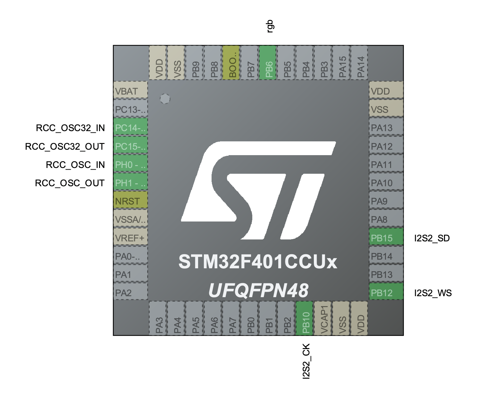
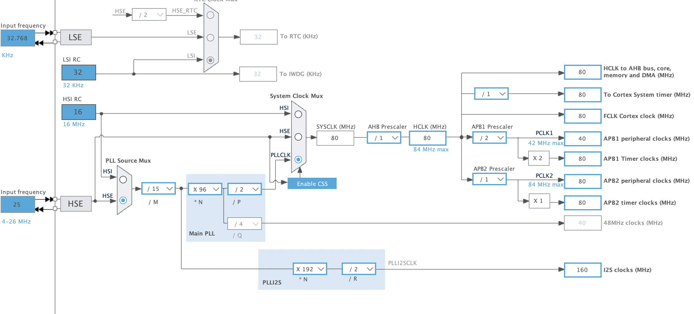
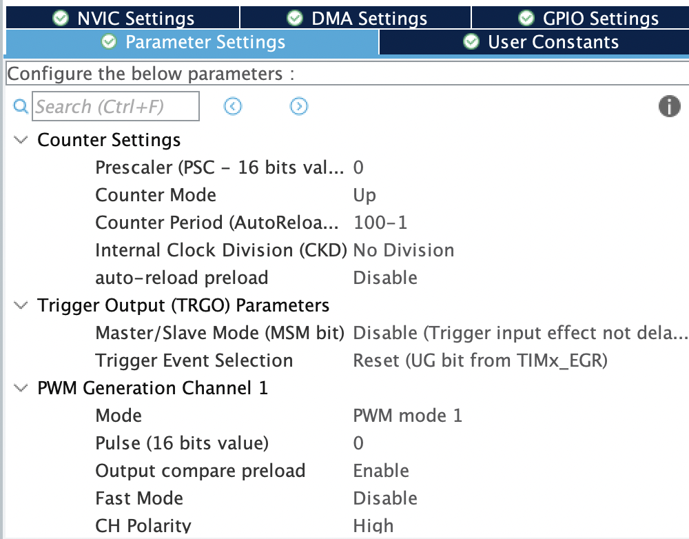
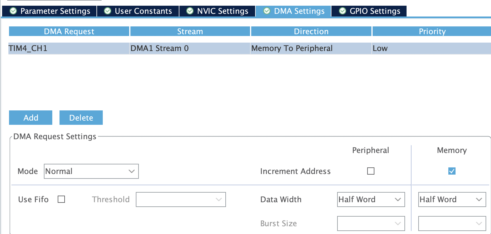
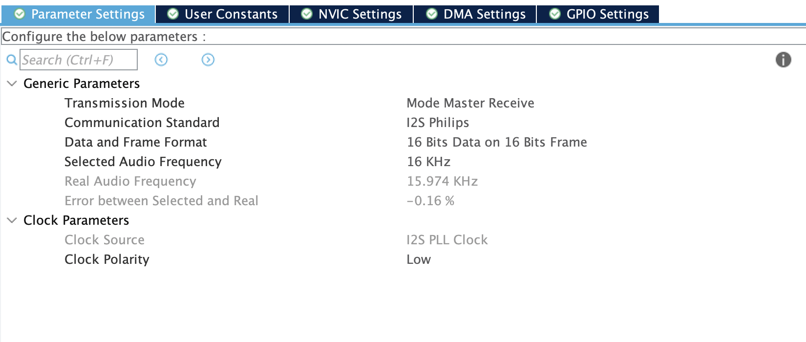
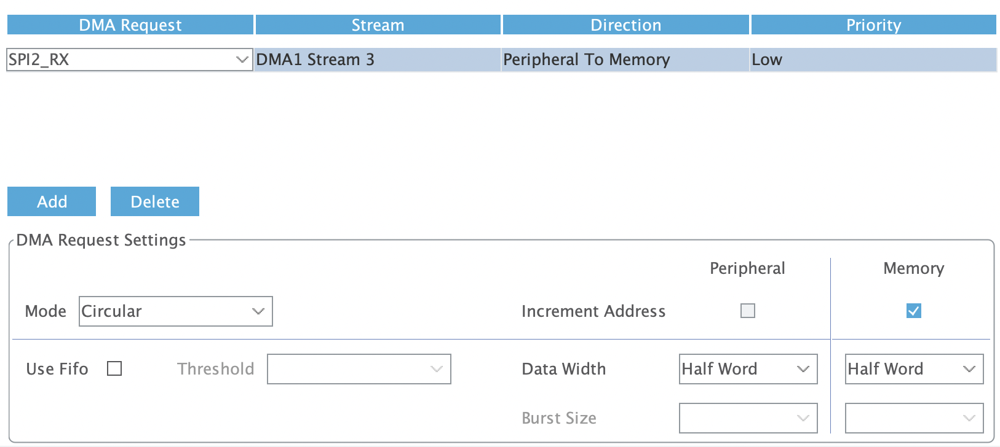

# 🎵 STM32 I2S VU Meter (WS2812)

A highly responsive, fluid VU Meter powered by an STM32 microcontroller. This project utilizes a digital I2S MEMS microphone for high-fidelity audio sampling and addressable WS2812 LEDs for visualization.


## 🌟 Key Features

* **Digital Audio Acquisition:** Uses the I2S protocol via DMA (Direct Memory Access) to sample audio without blocking the CPU.
* **Logarithmic Scaling:** LED thresholds are calculated using a geometric progression to match the human ear's non-linear perception of volume (dB).
* **Fluid Rendering:** Runs at a stable 50Hz refresh rate with a custom "peak decay" effect for a professional look.
* **Efficient LED Driver:** Controls **133 LEDs** using TIM4 PWM + DMA to generate WS2812 signals with precise timing.

## 🛠️ Hardware Requirements

| Component | Function | Notes |
| :--- | :--- | :--- |
| **STM32F4xx** | Microcontroller | (e.g., Black Pill F411 or F401) |
| **INMP441** | MEMS Microphone | I2S Interface, Omnidirectional |
| **WS2812B** | LED Strip | 133 LEDs configured in code |
| **5V PSU** | Power Supply | Ensure enough Amps for the LEDs |

## 🔌 Wiring & Pinout

> **Note:** Pin assignments are based on the CubeMX configuration.

| Peripheral | STM32 Pin | Sensor/Strip Pin |
| :--- | :--- | :--- |
| **I2S2 (SPI2)** | PB10 (CK) | SCK (Serial Clock) |
| | PB15 (SD) | SD (Serial Data) |
| | PB12 (WS) | WS (Word Select) |
| **TIM4 CH1** | PB6 | DIN (Data Input) |

### Pinout

### CubeMx Configurations






## 💻 Software Details

The core logic is implemented in `main.c`. The system uses a non-blocking architecture.

### 1. Audio Pipeline (I2S + DMA)
The microphone data fills a circular buffer (`i2s_dma_buffer`) of 256 samples.
```c
// DMA Half-Complete and Complete callbacks ensure continuous stream processing
void HAL_I2S_RxHalfCpltCallback(...) { ... }
void HAL_I2S_RxCpltCallback(...) { ... }